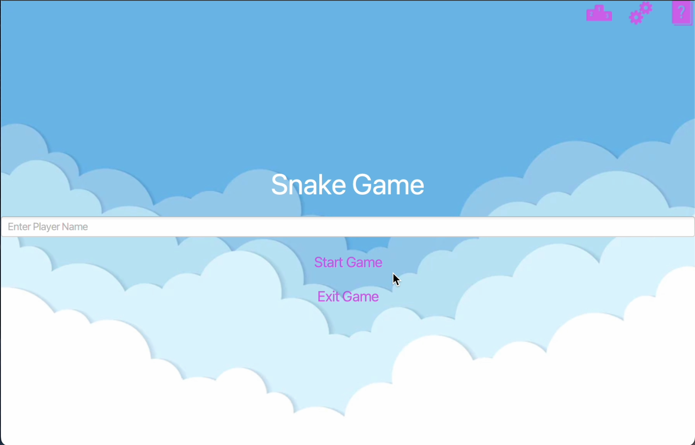
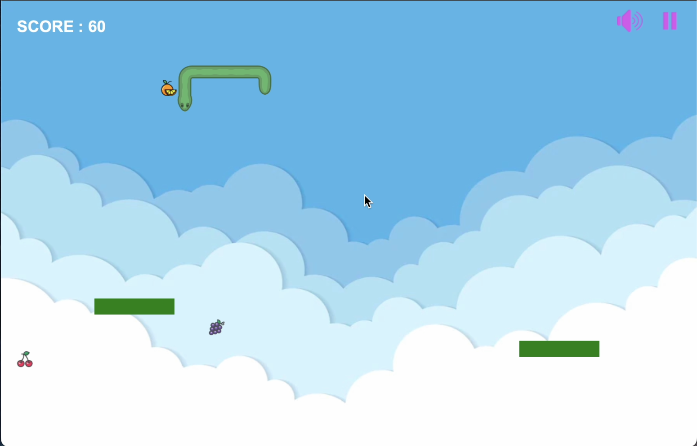
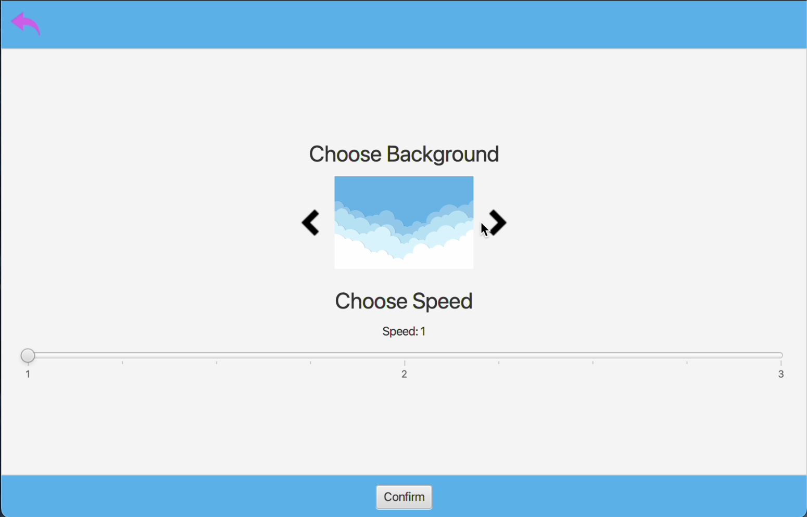
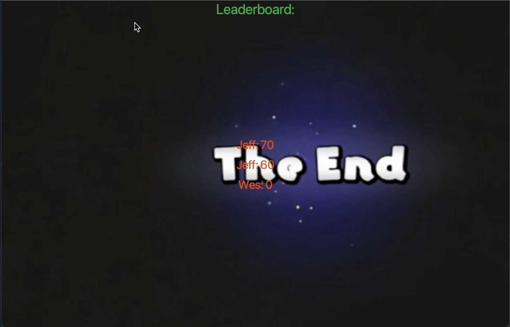

# 🐍 JavaFX Snake Game

A modern twist on the classic Snake game, built with JavaFX. Includes custom backgrounds, adjustable speed levels, background music, and a persistent leaderboard.

---

## 🎮 Overview

This project recreates the nostalgic Snake game experience with a clean interface and rich interactivity. It features smooth animations, menu screens, game-over states, and dynamic difficulty control.

### 🧠 Core Features

- **Snake Gameplay**:
  - Eat food to grow and earn points
  - Avoid self-collision and borders
- **Customizable Settings**:
  - Choose from multiple background themes
  - Select game speed (3 levels)
- **UI Menus**:
  - Main menu, pause screen, and game-over menu
- **Leaderboard System**:
  - Stores player names and scores across sessions
- **Audio Integration**:
  - Background music and sound effects
  - Mute and unmute toggle
- **Polished JavaFX UI**:
  - Styled with CSS and custom assets

---

## 🖼️ Screenshots

### 🎬 Main Menu


---

### 🐍 Gameplay


---

### ⚙️ Settings Screen


---

### 🏆 Leaderboard + Game Over


---

## 🎯 Purpose

> “How can classic games be enhanced with modern UI, player settings, and persistent data in JavaFX?”

This project demonstrates the use of event-driven programming, UI layering, and object-oriented design in JavaFX.

---

## 🚀 Getting Started

### ✅ Requirements

- Java 8 or later
- JavaFX SDK
- IDE (like IntelliJ IDEA or Eclipse)

### ▶ Run the Game

1. Clone the repository
2. Ensure JavaFX is properly configured in your project settings
3. Run `App.java` as a JavaFX Application

### 🗂 Project Structure

```bash
├── App.java              # Main entry point for the game
├── GameFrameFX.java      # JavaFX stage setup and layout
├── GameScreenFX.java     # Scene management and screen transitions
├── GameSnakeFX.java      # Core game logic and rendering
├── Settings.java         # Settings screen for background and speed selection
├── resources/            # Image, audio, and CSS files
└── README.md
```
### 📈 Example Gameplay Flow
```text
1. Launch the game
2. Choose background and speed in settings
3. Control the snake with arrow keys
4. Pause/resume anytime
5. After game over, enter your name and view leaderboard
```
